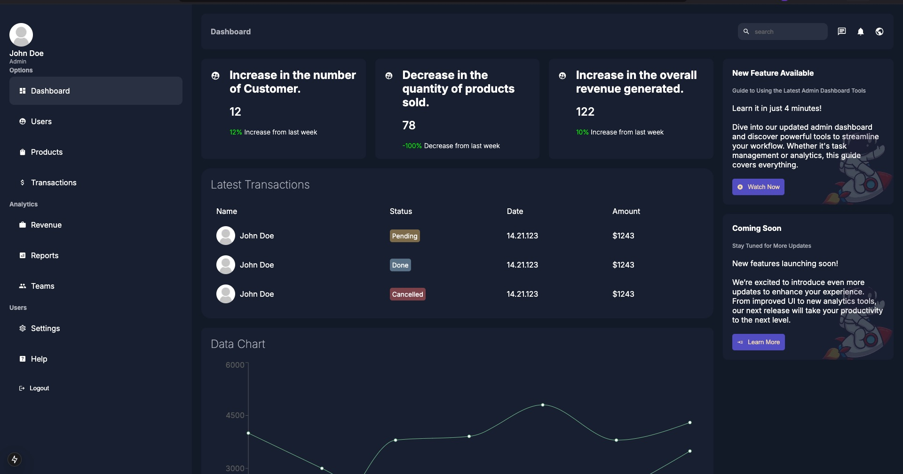

# Next.js Dashboard with MongoDB Integration

This repository demonstrates how to build a modern Next.js dashboard application that integrates with MongoDB, handles user authentication, and provides a user search feature. It also includes how to fetch data using Next.js methods and securely manage MongoDB API keys.

### Table of Contents
1. Prerequisites
2. Setup MongoDB
3. Authentication Setup
4. User Searching
5. Fetching Data
6. Server Actions
7. MongoDB API Key Handling
8. Environment Variables
9. Deployment

### Prerequisites
Ensure you have the following installed:
- **Node.js** (>= 16.x)
- **npm** or **yarn**
- **MongoDB Atlas** account (for database hosting)
- **Next.js 13.x**

### Setup MongoDB

#### MongoDB Atlas Setup
1. **Create an Account**: Sign up at [MongoDB Atlas](https://www.mongodb.com/cloud/atlas).
2. **Create a Cluster**: After logging in, create a new cluster (free-tier is sufficient).
3. **Create a Database**: In the MongoDB Atlas UI, create a database (e.g., `users` database).
4. **Create a Database User**: Add a user with access to the database.

#### Connect MongoDB to Next.js
1. **Install MongoDB client**:

   ```
   npm install mongodb
   ```

2. **Create MongoDB Connection Utility** (`lib/mongodb.js`):

   ```js
   import { MongoClient } from "mongodb";

   const client = new MongoClient(process.env.MONGO_URI);

   export const connectToDb = async () => {
     if (!client.isConnected()) {
       await client.connect();
     }
     return client.db();
   };
   ```

3. **Store MongoDB URI in .env.local**:

   ```
   MONGO_URI=mongodb+srv://<username>:<password>@cluster0.mongodb.net/mydatabase?retryWrites=true&w=majority
   ```

---

### Authentication Setup
We use NextAuth.js for handling authentication in this application.

#### NextAuth Setup
1. **Install next-auth**:

   ```
   npm install next-auth
   ```

2. **Configure NextAuth** (`lib/auth.js`):

   ```js
   import NextAuth from "next-auth";
   import Providers from "next-auth/providers";

   export default NextAuth({
     providers: [
       Providers.Credentials({
         name: "Credentials",
         credentials: {
           email: { label: "Email", type: "email" },
           password: { label: "Password", type: "password" },
         },
         authorize: async (credentials) => {
           const user = await fetchUserFromDatabase(credentials.email, credentials.password);
           if (user) {
             return user;
           } else {
             return null;
           }
         },
       }),
     ],
     pages: {
       signIn: "/login",
     },
     callbacks: {
       async session(session, user) {
         session.user = user;
         return session;
       },
     },
   });
   ```

3. **Use `useSession` to manage authentication state** in your components:

   ```js
   import { useSession } from "next-auth/react";

   const Profile = () => {
     const { data: session } = useSession();

     if (!session) {
       return <p>You are not logged in.</p>;
     }

     return <div>Welcome, {session.user.name}</div>;
   };
   ```

---

### User Searching
The app includes a search feature to find users in the MongoDB database.

#### Search API
1. **Create a Search API Route** (`pages/api/searchUsers.js`):

   ```js
   import { connectToDb } from "../../lib/mongodb";

   export default async (req, res) => {
     const db = await connectToDb();
     const { query } = req.query;

     if (!query) {
       return res.status(400).json({ message: "Query parameter is missing" });
     }

     try {
       const users = await db
         .collection("users")
         .find({ name: { $regex: query, $options: "i" } })
         .toArray();

       res.status(200).json(users);
     } catch (error) {
       res.status(500).json({ message: "Error searching users", error });
     }
   };
   ```

#### Search Component
2. **Create a Search Input Component** (`components/SearchBar.js`):

   ```js
   import { useState } from "react";

   const SearchBar = () => {
     const [query, setQuery] = useState("");
     const [results, setResults] = useState([]);

     const handleSearch = async () => {
       if (query.trim() === "") return;

       const response = await fetch(`/api/searchUsers?query=${query}`);
       const data = await response.json();

       setResults(data);
     };

     return (
       <div>
         <input
           type="text"
           value={query}
           onChange={(e) => setQuery(e.target.value)}
           placeholder="Search users"
         />
         <button onClick={handleSearch}>Search</button>

         <ul>
           {results.map((user) => (
             <li key={user._id}>{user.name}</li>
           ))}
         </ul>
       </div>
     );
   };

   export default SearchBar;
   ```

---

### Fetching Data
You can fetch data in Next.js using `getServerSideProps`, `getStaticProps`, or API routes.

#### Server-Side Fetching Example

```js
// pages/dashboard.js
import { connectToDb } from "../lib/mongodb";

export async function getServerSideProps() {
  const db = await connectToDb();
  const users = await db.collection("users").find().toArray();

  return {
    props: { users },
  };
}

const Dashboard = ({ users }) => {
  return (
    <div>
      <h1>Dashboard</h1>
      <ul>
        {users.map((user) => (
          <li key={user._id}>{user.name}</li>
        ))}
      </ul>
    </div>
  );
};

export default Dashboard;
```

---

### Server Actions
In Next.js 13+, Server Actions allow you to perform server-side operations directly in React components.

#### Example of Server Action:

```js
// app/dashboard/page.js
import { useServerAction } from 'next/actions';

const fetchUserData = async () => {
  const res = await fetch('/api/users');
  return res.json();
};

export default function Dashboard() {
  const { data, error } = useServerAction(fetchUserData);

  if (error) return <div>Error: {error.message}</div>;

  return (
    <div>
      <h1>Dashboard</h1>
      <ul>
        {data.map((user) => (
          <li key={user._id}>{user.name}</li>
        ))}
      </ul>
    </div>
  );
}
```

---

### MongoDB API Key Handling

#### Securely Store MongoDB API Key
Store your MongoDB URI securely in the `.env.local` file:

```
MONGO_URI=mongodb+srv://<username>:<password>@cluster0.mongodb.net/mydatabase?retryWrites=true&w=majority
```

#### Access the MongoDB URI in Code:

```js
// lib/mongodb.js
import { MongoClient } from "mongodb";

const client = new MongoClient(process.env.MONGO_URI);

export const connectToDb = async () => {
  if (!client.isConnected()) {
    await client.connect();
  }
  return client.db();
};
```

---

### Environment Variables
Ensure the following variables are set in your `.env.local` file:

```
MONGO_URI=mongodb+srv://<username>:<password>@cluster0.mongodb.net/mydatabase?retryWrites=true&w=majority
NEXTAUTH_URL=http://localhost:3000
```

---

### Deployment
1. **Push the Code to GitHub**.
2. **Connect Your GitHub Repository to Vercel**.
3. **Set Environment Variables** in Vercel's dashboard (e.g., `MONGO_URI`).
4. **Deploy the Application**.

---

### License
MIT License. See LICENSE for more details.